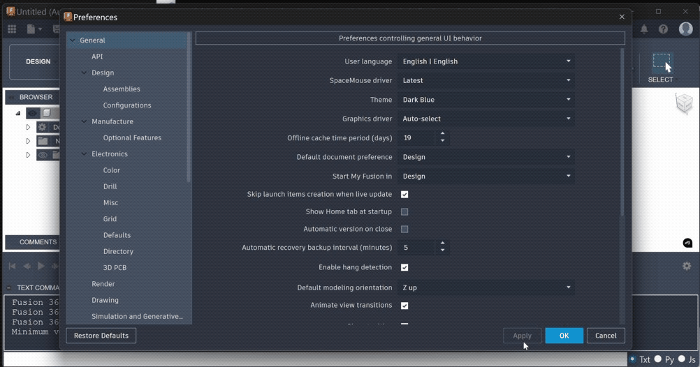

# DarkModeActivator
 Enable the darkmode for Autodesk Fusion

## How to use
Download the [current release](github.com/100prznt/DarkModeActivator/releases/latest) and copy all files from the zip archive in a directory without access restriction (e.g. C:/Program Files/DarkModeActivator). After the DarkModeActivator.exe has been executed, the dark mode can be selected in the Autodesk Fusion preferences.
Because the settings are reset every time Fusion is updated. You can create a scheduled task that executes the executable each system start. The DarkModeActivator always checks whether the relevant settings are set; if this is the case, the configuration is not changed.

## Darkmode preview

